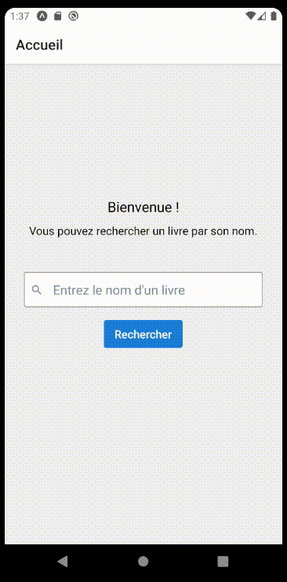
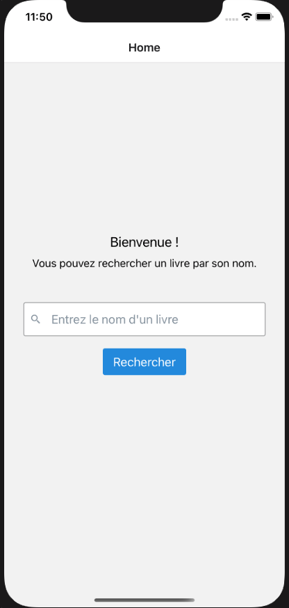
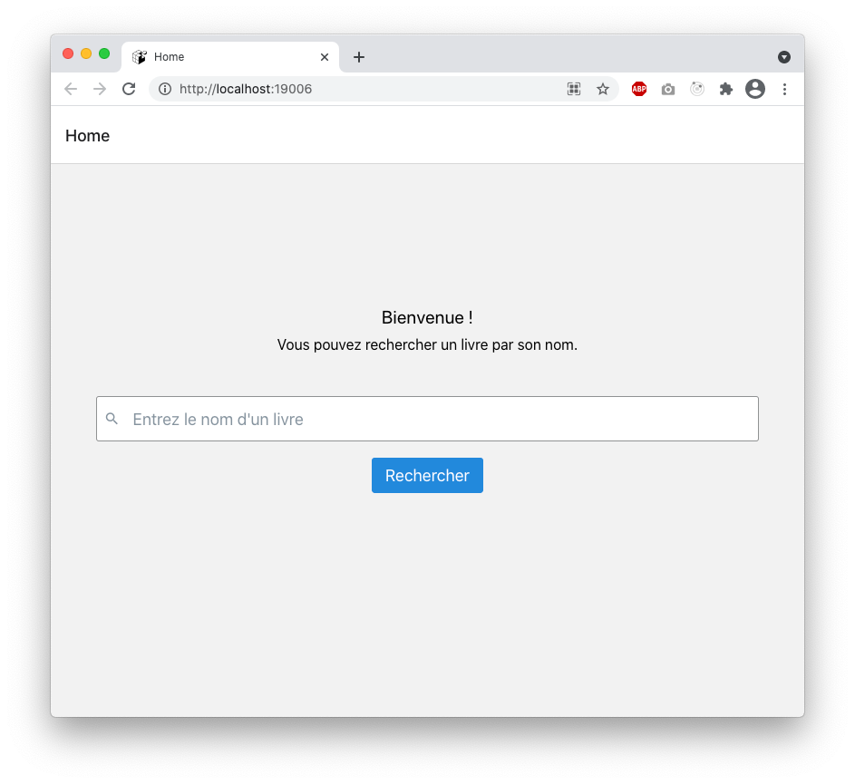
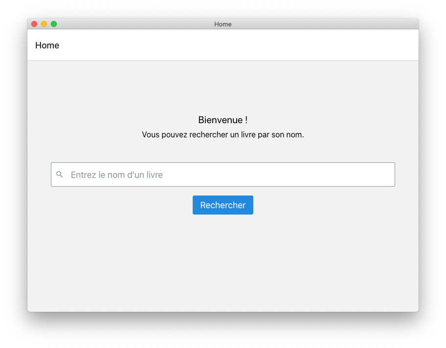

# Contexte :

Une terrible catastrophe mondiale est arrivée, les moteurs de recherches ne fonctionnent plus !

Vous devez absolument réparer ou créer un nouveau moteur de recherche, mais comment faire sans avoir accès à tout le savoir organisé par les moteurs de recherches ?

Le savoir se trouve encore dans l'ensemble des livres écrits par l'Humanité, mais quel livre lire ?

Pour remédier à cela, un système de recherche de livre a été créé, ce système est accessible depuis une page web, une application pour ordinateur de bureau et une application pour téléphone mobile.

# Couche technique :

L'application est entièrement programmé via le framework React Native et l'environement Electron.

Elle utilise la blibliothèque Redux.

L'ensemble des requête sont envoyés à l'API de Google de livre (https://www.googleapis.com/books/v1/).

Un seul code source permet de générer les 4 versions de l'application (Web, Desktop, Android, iOS).

# Utilisation en mode développement :

Pour lancer l'application sur les plateformes différentes à la racine du projet :
- `yarn run android` 
- `yarn run ios`
- `yarn run web`
- `yarn run electron`

# Résultat :

| Application Android  |
| - |
|  |

| Application iOS  |
| - |
|  |

| Navigateur web  |
| - |
|  |

| Application ordinateur de bureau (Electron)  |
| - |
|  |